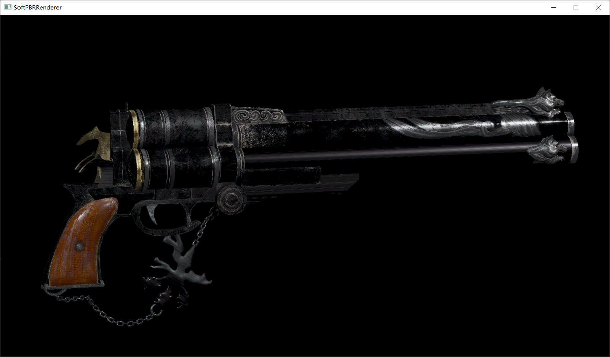

# Soft PBR Renderer

[一个简单的实现基于物理的软渲染器](https://github.com/wyzwzz/SoftPBRRenderer)

## Features
### Accelerate
* Frustum Cull 只渲染位于相机视锥体内的模型
* Back Face Culling 三角形背面剔除
* Geometry Clip 剔除整个位于标准化设备坐标外的三角形
* Hierarchy Z-Buffer Test (optional) 只栅格化通过层次ZBuffer测试的三角形 
* Early Z-Buffer Test 只对通过ZBuffer Test的片段进行着色计算
* OpenMP
### Render
* Physical Base Render
* Gamma Correction
* Support Multiple Models And Lights
* Support Model Transform And Model Loading Dynamically

## ScreeShots

